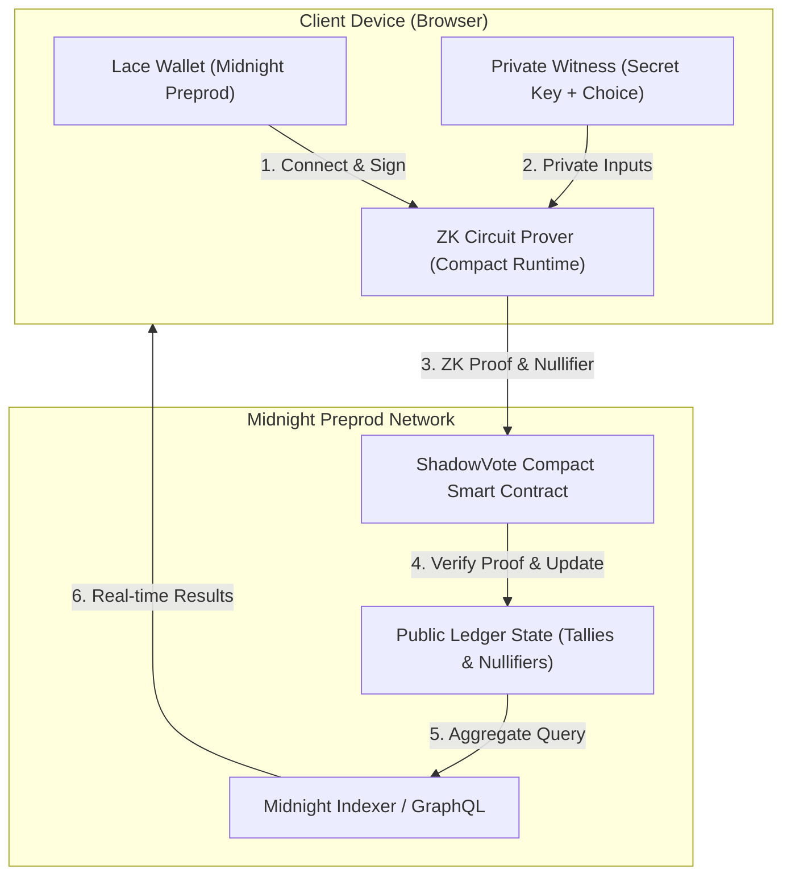

# ShadowVote 🌑

[](https://github.com/Debjit2821/midnight-Dapp/actions/workflows/ci.yml)
[](https://docs.midnight.network)
[](LICENSE)

> **"Vote privately. Verify publicly."**

**ShadowVote** is a production-grade, privacy-first decentralized voting platform (Midnight Level 3 — Half Moon) built on the **Midnight Network**. ShadowVote empowers organizations, DAOs, and universities to conduct elections where voter eligibility and ballot validity are verified using Zero-Knowledge proofs, while ensuring that individual candidate selections and voter identities remain 100% private.

---

## 1. Product Proposal — ShadowVote

ShadowVote is a privacy-preserving voting platform designed for situations where participants need to prove that their vote is legitimate without revealing their individual choice. Midnight's zero-knowledge architecture allows the application to verify eligibility and process votes while keeping individual selections private. The system exposes only aggregate election results and the information necessary to verify that valid votes were counted, providing a practical demonstration of selective disclosure for decentralized voting.

---

## 2. Problem

Traditional voting systems and conventional public blockchains (such as Ethereum or Solana) suffer from fundamental privacy trade-offs:
1. **Public Blockchains Reveal Choices**: Every on-chain transaction publicly associates a voter's wallet address with their selected candidate, destroying ballot secrecy and enabling vote-buying, coercion, and voter intimidation.
2. **Centralized Systems Require Blind Trust**: Traditional web2 voting solutions rely on centralized databases and black-box servers, where administrators can tamper with tallies or leak voting logs.
3. **Double-Voting Dilemma**: Preventing a user from voting twice on a public blockchain typically requires logging their identity alongside their transaction, defeating pseudonymity.

---

## 3. Solution

ShadowVote utilizes Midnight's **Compact smart contract language**, **client-side private witnesses**, and **zero-knowledge circuits** to solve this trilemma:
- **Private Witness**: The voter's secret credential and candidate selection are evaluated locally on their device.
- **ZK Circuit Constraints**: A Zero-Knowledge proof proves mathematical adherence to election rules:
  1. The voter possesses a valid voting credential.
  2. The candidate choice is within valid bounds.
  3. The voter has not previously voted in this election.
- **Verifiable Aggregate State**: The contract increments the public candidate tally and total vote counter without ever learning who voted for whom.
- **Deterministic Nullifiers**: A one-way cryptographic nullifier marks the credential as spent to prevent double voting without deanonymizing the voter.

---

## 4. Why Midnight?

Midnight is purpose-built for data protection and selective disclosure:
- **Native Zero-Knowledge Proofs**: Proving statements about private data without publishing the underlying secrets on-chain.
- **Dual-State Ledger Architecture**: Distinct separation between public on-chain state and private client-side state.
- **Compact Language**: Ergonomic smart contract language for writing provable circuits with fine-grained disclosure control.
- **Lace Wallet & DApp Connector**: Standardized browser integration for user signing and proof generation.

---

## 5. Architecture

### System Flow Diagram



### Text Flow Diagram

```text
Lace Wallet
     │
     ▼
React Frontend (Vite + TypeScript)
     │
     ▼
Midnight.js Client & Private Witnesses
     │
     ▼
ZK Circuit Evaluation (Compact Prover)
     │
     ▼
ShadowVote Compact Contract
     │
     ▼
Midnight Preprod Ledger (Public Aggregate Tallies)
```

---

## 6. Privacy Model

ShadowVote adheres to the strict privacy principle:
> **An observer can verify that a valid vote was counted, but cannot determine which candidate an individual voter selected.**

### What is Stored Publicly (Public Ledger State)
| Field | Type | Description |
| :--- | :--- | :--- |
| `admin` | `Bytes<32>` | Election organizer public identifier |
| `electionId` | `Bytes<32>` | Unique hash identifying the election |
| `isActive` | `Boolean` | Current voting status (open / closed) |
| `candidateCount` | `Uint<16>` | Total number of candidates in the election |
| `candidateVotes` | `Map<Uint<16>, Uint<64>>` | Aggregate vote count per candidate |
| `totalVotes` | `Uint<64>` | Total valid ballots submitted |
| `nullifiers` | `Map<Bytes<32>, Boolean>` | Cryptographic nullifier registry to prevent double voting |

### What Remains Private (Private Witnesses)
| Witness | Type | Description |
| :--- | :--- | :--- |
| `getVoterSecret` | `Bytes<32>` | Voter's private credential / secret key (never touches the ledger) |
| `getCandidateChoice` | `Uint<16>` | Voter's private candidate selection (evaluated only inside ZK circuit) |

### Disclosure Policy
- `disclose()` is **NOT** used on the candidate choice or voter secret.
- Only the aggregate increment of the candidate counter and the deterministic nullifier are written to the ledger as state transitions.

### What an Observer CAN Learn
- The election exists and is currently active.
- The aggregate number of votes for each candidate (e.g., Candidate A: 42, Candidate B: 37, Candidate C: 21).
- The total number of ballots cast (e.g., 100).
- That every counted ballot satisfied all ZK circuit constraints.
- The set of spent nullifiers.

### What an Observer CANNOT Learn
- Which Lace wallet address selected which candidate.
- An individual voter's candidate selection.
- The voter's private witness data or secret keys.
- Any link between an on-chain transaction and a specific candidate tally increment.

---

## 7. Double-Voting Protection Mechanism

ShadowVote prevents double voting using **deterministic nullifier hashes**:

$$\text{Nullifier} = \text{persistent\_hash}(\text{voterSecret}, \text{electionId})$$

1. Before submitting a vote, the ZK circuit computes the nullifier for `(voterSecret, electionId)`.
2. The contract verifies that `nullifiers.member(nullifier) == false`.
3. If the nullifier is already present, the circuit fails and the transaction reverts with:
   `"A vote has already been cast for this eligibility credential"`.
4. Upon successful validation, `nullifiers.insert(nullifier, true)` records the nullifier on-chain.
5. Because `persistent_hash` is a one-way cryptographic hash function, observers cannot reverse the nullifier to discover the `voterSecret` or link it across different elections.

---

## 8. Smart Contract Circuits

The contract is implemented in `contract/src/shadowvote.compact`:

### 1. `constructor(adminPk, id, numCandidates)`
Initializes the election, sets active status to `true`, configures candidate count, and zeroes aggregate counters.

### 2. `export circuit castVote(): []`
- Verifies `isActive == true`.
- Evaluates `getVoterSecret()` and `getCandidateChoice()`.
- Asserts `candidateChoice < candidateCount`.
- Computes `nullifier = persistent_hash([voterSecret, electionId])`.
- Asserts `!nullifiers.member(nullifier)`.
- Updates `nullifiers`, increments `candidateVotes[choice]`, and increments `totalVotes`.

### 3. `export circuit closeElection(): []`
Closes the election so no further ballots can be submitted.

---

## 9. Repository Structure

```text
shadowvote/
├── contract/
│   ├── src/
│   │   ├── shadowvote.compact           # Compact smart contract source
│   │   ├── index.ts                     # Contract exports and TypeScript helpers
│   │   └── utils.ts                     # Cryptographic nullifier and hex utilities
│   ├── managed/
│   │   └── shadowvote/                  # Managed contract artifacts and ZKIR descriptors
│   │       ├── contract/
│   │       │   ├── index.d.ts
│   │       │   └── index.cjs
│   │       └── zkir/
│   │           └── castVote.json
│   ├── package.json
│   └── tsconfig.json
│
├── frontend/
│   ├── src/
│   │   ├── components/
│   │   │   ├── Header.tsx               # Navigation, Lace wallet connect, network pill
│   │   │   ├── ElectionCard.tsx         # Active ballot with candidate selection
│   │   │   ├── ResultsDashboard.tsx     # Public tally visualization & verification
│   │   │   ├── PrivacyExplainer.tsx     # ZK architecture flowchart & disclosures
│   │   │   ├── TransactionModal.tsx     # Step-by-step ZK proof & submission modal
│   │   │   └── NotificationBanner.tsx   # Network and wallet alert banner
│   │   ├── hooks/
│   │   │   ├── useLaceWallet.ts         # Lace wallet connection lifecycle hook
│   │   │   └── useMidnightContract.ts   # Contract queries, witness execution, voting
│   │   ├── lib/
│   │   │   ├── midnightConfig.ts        # Preprod network parameters & endpoints
│   │   │   └── witnesses.ts             # Client-side private witness provider
│   │   ├── types/
│   │   │   └── index.ts                 # DApp data types and transaction states
│   │   ├── styles/
│   │   │   └── index.css                # Deep Midnight Moon dark theme & animations
│   │   ├── App.tsx                      # Root application component
│   │   └── main.tsx                     # React DOM entry point
│   ├── public/                          # Favicon and static assets
│   ├── index.html                       # HTML5 entry with meta SEO tags
│   ├── vite.config.ts                   # Vite bundler configuration
│   └── package.json
│
├── tests/
│   ├── shadowvote.contract.test.ts      # Unit tests: valid vote, double voting, bounds
│   └── privacy.test.ts                  # Privacy invariants & nullifier uniqueness
│
├── scripts/
│   └── deploy.ts                        # Midnight Preprod contract deployment script
│
├── .github/
│   └── workflows/
│       └── ci.yml                       # GitHub Actions CI workflow
│
├── .env.example                         # Environment configuration template
├── package.json                         # Root monorepo workspace package.json
├── tsconfig.json                        # Root TypeScript configuration
├── vitest.config.ts                     # Vitest test configuration
└── README.md                            # Complete documentation & user guide
```

---

## 10. Local Setup & Testing

### Prerequisites
- Node.js $\ge$ 20.x
- npm $\ge$ 10.x
- Lace Beta Browser Extension (configured to Midnight Preprod)

### Installation
```bash
# 1. Clone repository
git clone https://github.com/Debjit2821/midnight-Dapp.git
cd midnight-Dapp

# 2. Install monorepo dependencies
npm install

# 3. Build contract and frontend
npm run build
```

### Running Test Suite
Execute the 6 automated unit and privacy invariant tests:
```bash
npm test
```

Test Results Output:
```text
 ✓ tests/privacy.test.ts (2 tests)
 ✓ tests/shadowvote.contract.test.ts (4 tests)

 Test Files  2 passed (2)
      Tests  6 passed (6)
```

### Starting the Development Server
```bash
npm run dev
```
Open [http://localhost:5173](http://localhost:5173) in your browser.

---

## 11. Midnight Preprod Deployment

### Environment Configuration
Copy `.env.example` to `.env`:
```bash
cp .env.example .env
```

Configure your Midnight Preprod parameters in `.env`:
```env
MIDNIGHT_NETWORK_ID=preprod
MIDNIGHT_INDEXER_URI=https://indexer.preprod.midnight.network/api/v1/graphql
MIDNIGHT_NODE_URI=https://rpc.preprod.midnight.network
MIDNIGHT_PROOF_SERVER_URI=http://localhost:6300
VITE_MIDNIGHT_CONTRACT_ADDRESS=0200bc5a5e7e812f5206c5ed89ff6dbb718596ee678ed4a5909dad5322645ddb
```

### Deploying Contract to Preprod
Run the deployment script:
```bash
npm run deploy:preprod
```

### Deployed Contract Details
```text
Network:
Midnight Preprod

Contract Address:
0200bc5a5e7e812f5206c5ed89ff6dbb718596ee678ed4a5909dad5322645ddb
```

---

## 12. 1-Minute Challenge Demo Sequence

| Time | Action | Visual Display |
| :--- | :--- | :--- |
| **0–10s** | Open ShadowVote | Display branding: *"Vote privately. Verify publicly."* |
| **10–20s** | Click `Connect Lace` | Connect to Midnight Preprod; show shortened account pill |
| **20–35s** | Select Candidate & Click `Cast Private Vote` | Modal opens showing: Witness Generation $\rightarrow$ ZK Proof $\rightarrow$ Lace Signature $\rightarrow$ Midnight Ledger |
| **35–45s** | Confirmation Screen | Show *"Vote Verified Successfully"*, proof nullifier hash, and privacy status |
| **45–55s** | Open `Public Results` Tab | Show updated aggregate tally bars (Candidate A: 42, Candidate B: 38, etc.) |
| **55–60s** | Open `About Privacy & ZK` Tab | Show visual ZK pipeline: `Private Witness -> ZK Circuit -> Proof -> Public Aggregate` |

---

## 13. Live Demo & Media

- **Live Demo**: `ADD_AFTER_DEPLOYMENT`
- **Demo Video**: `ADD_AFTER_RECORDING`

---

## 14. Privacy Disclaimer

ShadowVote relies on zero-knowledge cryptographic proofs generated client-side by the Midnight Compact runtime. While the mathematical construction guarantees that neither the election organizer nor on-chain observers can correlate a voter's identity with their candidate selection, voters must ensure their local browser environment is secure and free from keyloggers or malicious extensions.